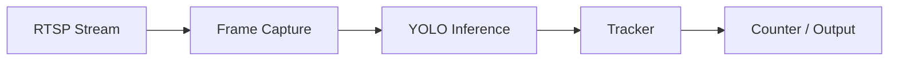

# Visual Assets Generator

Produce professional visuals for READMEs and social posts. Every project
README needs at least one visual above the fold. Store all outputs in the
project's `assets/` folder.

## 1. Demo GIFs (from output videos)

Use ffmpeg with a two-pass palette for crisp, small GIFs:

```bash
# Pass 1: generate palette
ffmpeg -y -i output.mp4 -vf "fps=12,scale=640:-1:flags=lanczos,palettegen" palette.png
# Pass 2: create GIF using palette
ffmpeg -y -i output.mp4 -i palette.png \
  -filter_complex "fps=12,scale=640:-1:flags=lanczos[x];[x][1:v]paletteuse" \
  assets/demo.gif
```

Rules:
- Target: 5-12 seconds, under 8 MB (GitHub renders inline up to 10 MB).
- Trim to the most impressive segment first: `-ss <start> -t <duration>`.
- If the GIF exceeds 8 MB, reduce fps to 10 and width to 480.
- If source footage may be sensitive/work-related, ASK the user before
  processing and offer to blur regions with ffmpeg's `boxblur` on a crop.

## 2. Banner images (repo/social headers)

Generate with Python (Pillow) at 1280x400 px:
- Dark background (#0d1117, GitHub dark) with a subtle grid or gradient.
- Project name in a bold sans-serif (DejaVu Sans Bold is always available),
  tagline underneath in a lighter gray (#8b949e).
- One accent color per project, drawn from: #76B900 (NVIDIA green),
  #5C3EE8 (OpenCV purple), #00599C (C++ blue), #3776AB (Python blue).
- Save as `assets/banner.png`, reference at the top of the README.
- Keep the script as `assets/make_banner.py` so it's reproducible.

## 3. Architecture / pipeline diagrams

Default to **Mermaid** inside the README (renders natively on GitHub):



- Left-to-right flow for pipelines, top-down for architectures.
- Max 8 nodes; if more, split into two diagrams.
- For diagrams needed as standalone images (LinkedIn posts), render Mermaid
  to PNG via mermaid-cli if available, otherwise draw with Pillow.

## 4. Benchmark / comparison charts

Use matplotlib, one chart per claim:
- Horizontal bar charts for FPS comparisons (e.g., CPU vs CUDA vs TensorRT).
- Style: `plt.style.use('dark_background')`, accent color #76B900,
  value labels on bars, no gridlines clutter, title states the takeaway
  ("TensorRT: 3.1x faster than ONNX Runtime on Jetson Orin").
- Save at 150 dpi as `assets/benchmark_<topic>.png`.

## Output checklist

- [ ] Asset saved under the correct project's `assets/` folder
- [ ] Referenced in the README (image embedded, not just committed)
- [ ] File size reasonable (GIF < 8 MB, PNG < 1 MB)
- [ ] No sensitive/work footage published without explicit user approval
