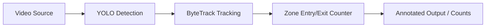

# People Counting

Real-time people detection and counting with entry/exit zone logic.

## Demo

<!-- TODO: demo.gif -->

## Features

- Detects people with YOLOv8, restricted to the person class.
- Tracks each person across frames to avoid double-counting.
- Counts entries and exits separately for a configurable rectangular zone.
- Draws the zone and live counts on the output video.
- Runs on any video file, RTSP stream, or webcam index.
- Optionally exports an annotated output video.

## How it works



Each frame is run through YOLO detection restricted to the person class,
then Ultralytics' built-in ByteTrack tracker assigns a stable id to each
person. The counter checks whether a track's centroid is inside the
configured rectangular zone and compares that against its state on the
previous frame to detect an entry or exit, incrementing the count exactly
once per transition.

## Installation

1. Create a virtual environment: `python -m venv .venv && .venv\Scripts\activate`
2. Install dependencies: `pip install -r requirements.txt`

## Usage

```bash
python main.py --source rtsp://192.168.1.64/stream2 --zone 200 150 600 450
```

| Argument | Description | Default |
|---|---|---|
| `--source` | Video file path or RTSP/webcam stream URL | *required* |
| `--model` | YOLO weights path or name | `yolov8n.pt` |
| `--conf` | Detection confidence threshold | `0.4` |
| `--zone` | Rectangular zone as `x1 y1 x2 y2` | `200 150 600 450` |
| `--output` | Path to save the annotated output video | `None` (shows a live window) |

## Project structure

```
people-counting/
├── main.py             # CLI entry point, video loop
├── src/
│   ├── detector.py      # YOLO detection + tracking wrapper
│   └── zone_counter.py  # Entry/exit zone counting logic
├── requirements.txt
└── assets/
```

## Tech stack


## License + author

**Ahmed Akyol** — Computer Vision Engineer · [GitHub](https://github.com/llakyoll) · [LinkedIn](https://www.linkedin.com/in/ahmed-akyol-84766622b/)
