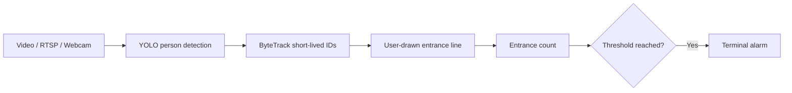

# Restroom Usage Alert

Counts people entering a restroom doorway from a video stream and prints a
terminal alarm when the configured total reaches a threshold. It uses only
short-lived tracker IDs needed to prevent duplicate counts; it does not perform
face recognition or save identities.

## Demo


[▶ Watch the annotated demo video](assets/demo.mp4)

## Workflow



A person is counted once when the bottom-center point of its detection box
(its approximate foot position) crosses the selected doorway line in the
configured direction.

## Installation

```bash
cd restroom-usage-alert
python -m venv .venv
# Windows: .venv\Scripts\activate
# macOS/Linux: source .venv/bin/activate
pip install -r requirements.txt
```

## Usage

```bash
python main.py --source path/to/video.avi --threshold 2
```

When the program opens, the first frame is shown for doorway calibration. Click
two points to define the ends of the entrance line, then press **Enter** to
begin. Press **R** to clear the points, or **Q** / Escape to cancel. The order
of the two points defines the direction used by `--entry-direction`. By default
both crossing directions are counted. Windows are maximized by default; use
`--windowed` if needed.

The calibrated fixed line is `start=(623, 424)`, `end=(280, 457)`. It is used
automatically on first run and the terminal prints the active coordinates. A
newly selected line is saved locally in `line_config.json` and overrides this
default on future runs. Use `--redraw-line` to choose and save a replacement.

For a vertical doorway line or opposite walking direction:

```bash
python main.py --source rtsp://camera/stream --entry-direction backward --threshold 20
```

| Argument | Description | Default |
|---|---|---|
| `--source` | Video path, RTSP URL, or webcam index | required |
| `--model` | YOLO weights path or name | `yolo26l.pt` |
| `--conf` | Minimum detection confidence | `0.4` |
| `--tracker` | Ultralytics tracker configuration | `botsort.yaml` |
| `--entry-direction` | `both`, or one side of the directed line: `forward` / `backward` | `both` |
| `--threshold` | Total entrance count that emits an alarm | `2` |
| `--output` | Optional annotated MP4 path | none (live window) |
| `--windowed` | Keep the calibration and preview windows unmaximized | off |
| `--redraw-line` | Redraw and replace the locally saved entrance line | off |

Input video formats include MP4, AVI, MOV, and MKV when their codec is
available in the local OpenCV/FFmpeg installation. For example:

```bash
python main.py --source assets/entrance.avi --threshold 10
```

Annotated output is saved with `--output assets/demo.mp4`. If OpenCV cannot
open an MP4 encoder, the application automatically uses the system `ffmpeg`
binary to produce an H.264 MP4.

### AVI troubleshooting

AVI is a container, not a codec. H.264 or MJPEG AVI files generally work, but
H.265/HEVC stored in AVI is often not supported and can be malformed. If the
source cannot open, re-encode it to a standard H.264 MP4 outside the project:

```bash
ffmpeg -err_detect ignore_err -i assets/video2.avi -c:v libx264 -crf 20 -c:a aac assets/video2-h264.mp4
python main.py --source assets/video2-h264.mp4 --threshold 10
```

## Video setup checklist

1. Click the two ends of a line spanning the doorway.
2. Both directions count by default. Use `forward` or `backward` only if one direction should be excluded.
3. Verify the annotated line before using the count operationally.

The preview shows `Tracked IDs`. It must be greater than zero while a person is
visible before a line crossing can be counted. Each accepted crossing is also
printed to the terminal. BoT-SORT is selected explicitly by default; use
`--tracker bytetrack.yaml` if a lighter tracker is preferred.

## Project structure

```
restroom-usage-alert/
├── main.py
├── requirements.txt
├── src/
│   ├── detector.py
│   └── counter.py
└── assets/             # Place supplied test videos here (not committed)
```
