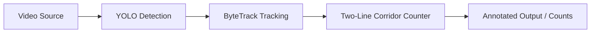

# Vehicle Counting

Counts vehicles passing through a two-line corridor in a video stream, with a live "in" count panel.

## Demo


## Features

- Detects cars, motorcycles, buses, and trucks with YOLOv8.
- Tracks each vehicle across frames to avoid double-counting.
- Counts a vehicle only once it has crossed both corridor lines in
  sequence, filtering out vehicles that merely touch one line and turn away.
- Displays a live "vehicles in" count panel on the video.
- Supports horizontal or vertical corridor lines.
- Runs on any video file, RTSP stream, or webcam index.
- Optionally exports an annotated output video.

## How it works



Each frame is run through YOLO detection restricted to vehicle classes, then
Ultralytics' built-in ByteTrack tracker assigns a stable id to each vehicle.
The counter tracks each vehicle's progress through two configured lines: it
only registers a count once a track has crossed the near line and then the
far line (direction "in"), or the far line and then the near line
(direction "out"). Crossing only one of the two lines does not count. The
on-screen panel and CLI summary report the "in" count.

## Installation

1. Create a virtual environment: `python -m venv .venv && .venv\Scripts\activate`
2. Install dependencies: `pip install -r requirements.txt`

## Usage

```bash
python main.py --source rtsp://192.168.1.64/stream1 --line1 320 --line2 400 --orientation horizontal
```

| Argument | Description | Default |
|---|---|---|
| `--source` | Video file path or RTSP/webcam stream URL | *required* |
| `--model` | YOLO weights path or name | `yolov8n.pt` |
| `--conf` | Detection confidence threshold | `0.4` |
| `--line1` | Pixel coordinate of the first corridor line | `320` |
| `--line2` | Pixel coordinate of the second corridor line | `400` |
| `--orientation` | `horizontal` or `vertical` | `horizontal` |
| `--output` | Path to save the annotated output video | `None` (shows a live window) |

## Project structure

```
vehicle-counting/
├── main.py            # CLI entry point, video loop
├── src/
│   ├── detector.py     # YOLO detection + tracking wrapper
│   └── counter.py      # Two-line corridor counting logic
├── requirements.txt
└── assets/
```

## Tech stack


## License + author

**Ahmed Akyol** — Computer Vision Engineer · [GitHub](https://github.com/llakyoll) · [LinkedIn](https://www.linkedin.com/in/ahmed-akyol-84766622b/)
